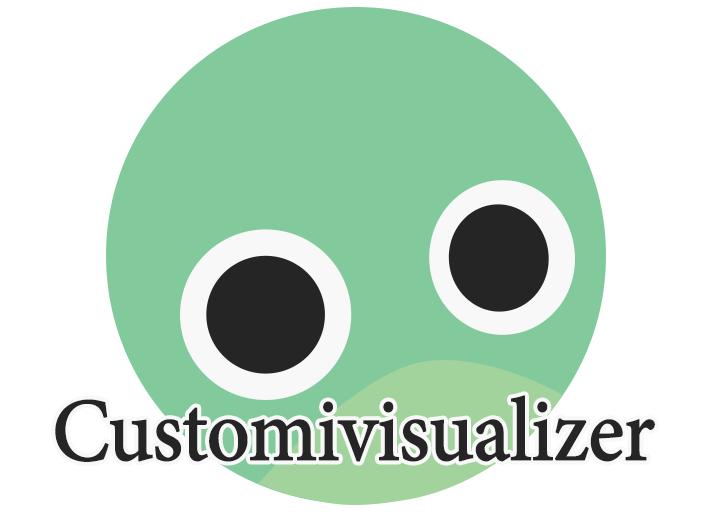

__Be advised:__ Not only is this my first Dalamud plugin, its in a very early stage of development so there may be bugs. If you encounter one, feel free to open a new issue.

Ever wanted to see how a potential fantasia will make your character appear in the various in-game environments/lighting? To see how emotes look on your new race/body type? To see how your old glams look on the new appearance?
Well, now you can.

This plugin allows modification of player character appearance data, sort of like how Anamnesis lets you change that stuff.

__Note:__ This plugin is not intead as a way to never buy a fantasia again, its just a more in depth "try before you buy". Please support the FFXIV developers!

* The game crashed when I changed a customization field value, what do?
  * You probably entered a value the game could not handle. Access the Dalamud plugin menu from the FFXIV main menu, and change the value back before logging in.
  
* To do:
  * Enable changing voices. Ever fantasiad with a certain voice only to discover it sounds like a wounded animal expelling its last death throes when you attack? I'd like this plugin to allow you to avoid that.
  
  
 Special thanks to avafloww of [OopsAllLalafells](https://github.com/avafloww/OopsAllLalafells) for giving me a clue on how to fiddle with character appearances